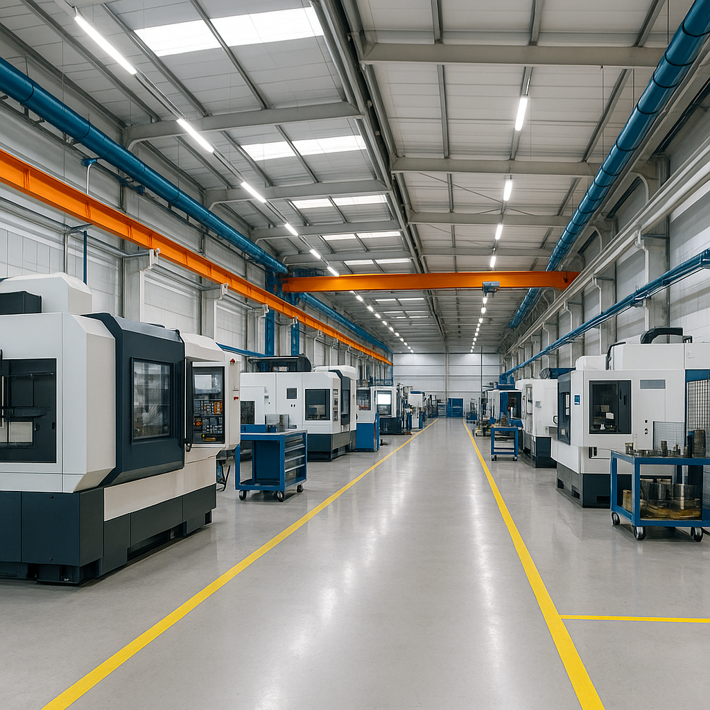

# 🏭 경매활용 공장구매 컨설팅

## 😰 이런 고민 때문에 밤잠을 설치고 계시나요?

### ❌ 공장입지분석의 복잡함에 좌절하셨나요?
- 복잡한 입지분석 방법론을 어디서부터 시작해야 할지 막막하신가요?
- 교통접근성, 물류비용, 용도지역 등 고려사항이 너무 많아 헷갈리시나요?
- 기존 컨설팅은 **천편일률적인 분석**으로 실제 도움이 되지 않았나요?

### ❌ 투자사업 수익성 예측의 어려움
- 임대수익률, 시세 상승 가능성을 정확히 계산하기 어려우신가요?
- **투자원금 회수 기간**을 명확히 알고 싶으신가요?
- 예상치 못한 부대비용으로 수익성이 악화될까 걱정되시나요?

### ❌ 경매 리스크 분석 전문지식 부족
- 권리분석, 채권최고액, 선순위 저당권 등이 복잡해 보이시나요?
- **낙찰 받고 나서 예상치 못한 문제**가 발생할까 두려우신가요?
- 기존 경매 컨설팅에서 **부정확한 분석으로 손실**을 경험하셨나요?

### ❌ 투자 타당성 판단 기준의 모호함
- 이 물건이 정말 투자할 만한 가치가 있는지 확신이 서지 않으시나요?
- 적정 낙찰가를 어떻게 산정해야 할지 막막하신가요?

**💡 지금 바로 [무료 타당성 검토 상담](#무료-상담-신청)을 신청하세요!**

---

## 🔥 AI CAMP만의 차별화된 솔루션

### 🏭 공장입지분석 전문 컨설팅
- **입지 점수화 시스템**: 교통, 물류, 인프라를 수치화하여 객관적 평가
- **업종별 맞춤 분석**: 제조업, 물류업, 지식산업 등 업종 특성 반영
- **미래 개발계획 반영**: 도시계획, 교통망 확장 등 장기 전망 포함

### 🔥 투자사업타당성분석 완전 대행
- **정밀 수익성 분석**: IRR, NPV, 회수기간 등 상세 재무분석
- **시나리오별 수익률 제시**: 보수적/중간/낙관적 시나리오 분석
- **리스크 요소 사전 차단**: 예상 리스크와 대응방안 미리 제시

### ✅ 정밀 물건 분석 & 타당성 검토
- **권리관계 완전 분석**: 등기부등본, 건축물대장 정밀 검토
- **하자 요소 사전 발견**: 현장 실사를 통한 숨은 하자 발굴
- **법적 리스크 제거**: 용도변경 가능성, 인허가 이슈 사전 점검

### ✅ 낙찰가 예측 분석 시스템
- **AI 기반 가격 예측**: 과거 낙찰 데이터 기반 최적 입찰가 산정
- **경쟁 입찰자 분석**: 시장 참여자 동향 분석으로 낙찰 확률 제고
- **입찰 전략 수립**: 1차, 2차 입찰 전략 및 상한가 설정

---

## 📊 시장 현황 및 기회

### 🏢 경매시장 규모와 기회
- 매월 **35,000여개**의 경매물건이 시장에 나옵니다
- 시장가 대비 **20-40% 절약** 가능한 기회의 시장입니다
- 하지만 **95%의 투자자가 전문 분석 없이 실패**하고 있습니다

### ⚠️ 기존 컨설팅의 치명적 문제점
- **부정확한 분석**으로 인한 투자 실패 사례 급증
- **사기성 컨설팅**으로 인한 피해 확산
- **천편일률적 분석**으로 개별 물건 특성 무시
- **사후 관리 부재**로 인한 투자자 방치

### 💎 AI CAMP의 검증된 성과
- **98% 고객 만족도** 달성 (지난 2년간)
- **평균 35% 수익률** 실현 (투자 완료 고객 기준)
- **제로 하자 발생률** (정밀 사전 분석 덕분)

**💡 지금 시장 기회를 놓치지 마세요! [무료 상담 신청](#무료-상담-신청)**

---

## 🚀 AI CAMP 4단계 완벽 프로세스

### 1️⃣ **타당성 검토 단계**
- 물건 정보 접수 및 1차 스크리닝
- 입지분석 및 시장성 검토
- 투자 타당성 예비 분석
- **무료 검토 결과 제공** ✨

### 2️⃣ **전략 수립 단계**
- 정밀 권리관계 분석 및 현장 실사
- 상세 재무분석 및 수익률 산정
- 리스크 분석 및 대응방안 수립
- 최적 낙찰가 및 입찰 전략 제시

### 3️⃣ **경매 참여 단계**
- 입찰서류 작성 및 대행 서비스
- 실시간 경매 현황 모니터링
- 낙찰 후 즉시 후속 절차 안내
- 소유권 이전 등기 지원

### 4️⃣ **사후 관리 단계**
- 임대 활용 전략 수립
- 세무 최적화 방안 제시
- 매각 타이밍 컨설팅
- **6개월 무료 사후 관리** 🎁

---

## 🏆 성과 보장 약속

### 💯 확실한 성과 보장
- **투자수익률 20% 이상** 달성 시에만 성공수수료 청구
- **하자 발생 시 100% 책임** 보상 (분석 오류 시)
- **낙찰 실패 시 분석비 50% 환불** 보장

### 🔒 투명한 수수료 체계
- 타당성 검토: **무료** (30만원 상당)
- 정밀 분석: **50만원** (고정)
- 성공수수료: **수익의 10%** (성공 시에만)

### 📞 **24시간 전담 컨설턴트 지원**
- 궁금한 점 언제든 실시간 상담
- 경매일 당일 현장 지원 서비스
- 투자 후 관리까지 책임지는 파트너십

---

## 🔗 유용한 경매/공매 사이트 모음

### 🏛️ **법원경매 사이트**
- [대법원 법원경매](https://www.courtauction.go.kr/){:target="_blank"} - 공식 법원경매 사이트
- [부동산태인](https://www.taein.co.kr/){:target="_blank"} - 39년 역사의 경매 전문
- [경매마당](https://madangs.com/){:target="_blank"} - 대법원경매 무료검색
- [옥션원](https://www.auction1.co.kr/){:target="_blank"} - 법원경매정보 No.1
- [두인경매](https://www.dooinauction.com/){:target="_blank"} - 전문가 컨설팅

### 🏢 **공매 사이트**
- [온비드(OnBid)](https://www.onbid.co.kr/){:target="_blank"} - 캠코 공식 공매사이트
- [마이옥션](https://www.my-auction.co.kr/){:target="_blank"} - 경매컨설팅 전문

### 🏭 **공장부지 전문**
- [공장네트웍스](https://공장창고전문부동산.com/){:target="_blank"} - 공장창고 전문 부동산
- [산업부동산](https://land.daara.co.kr/){:target="_blank"} - 지식산업센터 실거래가

---

## 📞 무료 상담 신청

### 🎁 **지금 신청하면 특별 혜택!**
- ✅ **30만원 상당 타당성 검토 무료** 제공
- ✅ **투자 가이드북** 무료 증정
- ✅ **1:1 전담 컨설턴트** 배정
- ✅ **경매 달력 및 체크리스트** 제공

### 📱 **상담 신청 방법**

**🔥 전화 상담 (즉시 연결)**
📞 **010-9251-9743**
- 평일 09:00~18:00
- 토요일 09:00~15:00
- 긴급상담 24시간 가능

**📧 이메일 상담**
✉️ **hongik423@gmail.com**
- 물건 정보 첨부하시면 빠른 1차 검토 가능
- 24시간 이내 회신 보장

### 💬 **상담 시 준비사항**
1. 관심 물건의 **경매법원 및 사건번호**
2. **투자 예산 규모**
3. **투자 목적** (임대사업, 본사 이전 등)
4. **투자 경험 유무**

---

### 🎯 **마지막 기회입니다!**

**경매시장의 기회는 하루하루 지나갑니다.**
**전문가의 도움 없이는 95%가 실패하는 것이 현실입니다.**

**🔥 지금 바로 무료 상담을 신청하고**
**안전하고 수익성 높은 공장투자의 첫걸음을 시작하세요!**

**📞 010-9251-9743 | ✉️ hongik423@gmail.com**

---

*AI CAMP은 고객의 성공적인 투자를 위해 최선을 다하겠습니다.* 